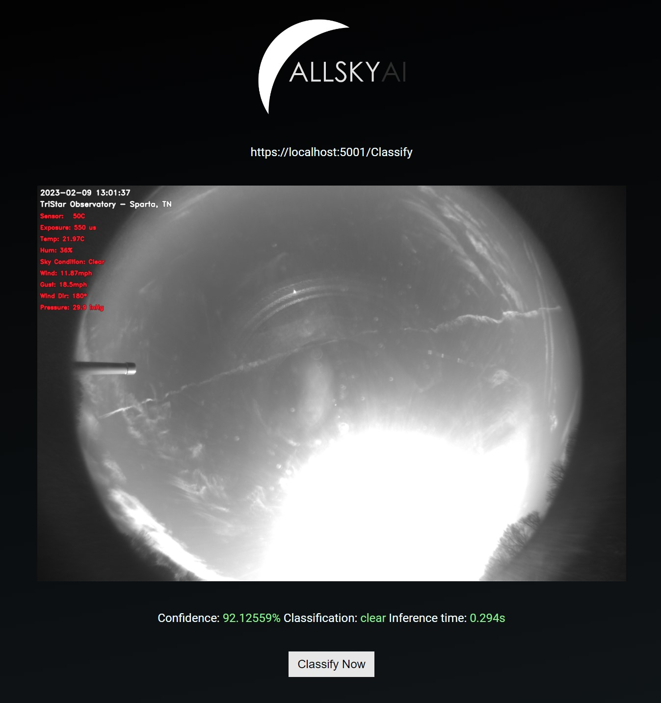

# AllSkyAI - ASPNetCore Client

This is a ASP.NET Core client for classifying sky conditions locally with a trained model from https://www.allskyai.com. When a request is sent it downloads the latest image from your AllSky and returns a classification that looks like this:

```{"classification":"clear","confidence":94.55865,"inference":0.156}```


It offers one simple preview page and a REST endpoint:</br>
Webpage: https://localhost:5001/</br>
REST: https://localhost:5001/Classify



## Confguration
First you need to download your model from https://www.allskyai.com (generic model is coming) and save it to the <code>./models/</code> directory. </br></br>

### config.cfg
In the extracted folder find a file called <code>config.cfg</code></br>
```
URL=https://<your-allsky>/image.jpg
MODEL=allskyai.onnx
```
Change these values to match your setup.

</br>

### appsettings.json
If you would like to change your running port please look in the <code>appsettings.json</code> file in the root of the folder.


